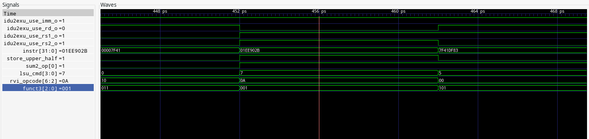
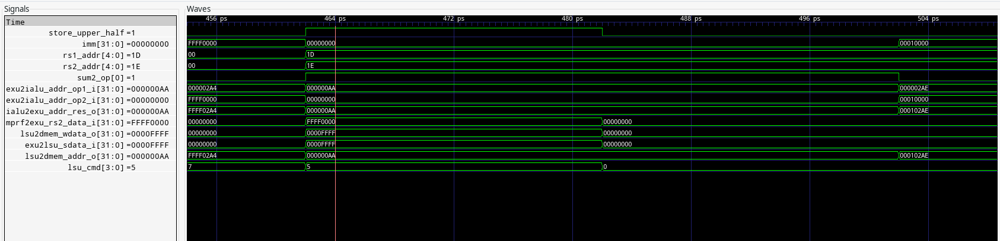

# Lab3: SCR1 RTL

## Задание

|Инструкция                                |Описание                            |
|------------------------------------------|----------------------------------- |
|Store upper half (SUH)|SUH: Сохранить старшие 16-bit регистра RS2 в память данных по адресу [RS1 + знаковая 12-bit константа]
## Выполнение

Для выполнения лабораторной работы были выполнены следующие действия:

### Добавление кастомной инструкции

1. В качестве опкода был выбран один из свободных - 0101011. Новый опкод добавлен в файл *[scr1_riscv_isa_decoding.svh](../src/includes/scr1_riscv_isa_decoding.svh)*. Для кодирования инструкции был выбран формат S-type, так как *SUH* использует *rs1*, *rs2* и 12-битную константу. *funct3* при этом всегда равен 001, но других подходящих форматов нет.

2. В файл *[scr1_riscv_isa_decoding.svh](../src/includes/scr1_riscv_isa_decoding.svh)* был добавлен новый управляющий сигнал для exu, показывающий, что сохранять необходимо только верхнюю половину *rs2*.

3. В *[scr1_pipe_idu.sv](../src/core/pipeline/scr1_pipe_idu.sv)* добавлено декодирование новой инструкции. Можно заметить, что по сути, она декодируется так же, как и инструкции *sw*, *sh*, *sb*, но выставляет сигнал *store_upper_half*.
```
SCR1_OPCODE_SUH_CUSTOM : begin
    idu2exu_use_rs1_o         = 1'b1;
    idu2exu_use_rs2_o         = 1'b1;
    idu2exu_use_imm_o         = 1'b1;
    idu2exu_cmd_o.store_upper_half  = 1'b1;
    idu2exu_cmd_o.sum2_op     = SCR1_SUM2_OP_REG_IMM;
    idu2exu_cmd_o.imm         = {{21{instr[31]}}, instr[30:25], instr[11:7]};
    case (funct3)
          3'b001  : idu2exu_cmd_o.lsu_cmd = SCR1_LSU_CMD_SH;
          default : rvi_illegal = 1'b1;
      endcase // funct3
`ifdef SCR1_RVE_EXT
                        if (instr[19] | instr[24])  rve_illegal = 1'b1;
`endif  // SCR1_RVE_EXT
                    end // SCR_OPCODE_SUH_CUSTOM_END
```	       

4. В *[scr_pipe_exu.sv](../src/core/pipeline/scr1_pipe_exu.sv)* внесены следующие изменения:
* Значение входного сигнала *store_upper_half* сохраняется в *exu_queue*
```
exu_queue.store_upper_half <= idu2exu_cmd_i.store_upper_half;
```
* В *lsu* сохранямое в память значение теперь определяется значением упомянутого выше сигнала, чтобы обеспечить работу как *suh*, так и других команд.
```
.exu2lsu_sdata_i      (exu_queue.store_upper_half ? mprf2exu_rs2_data_i[31:16] : mprf2exu_rs2_data_i),    // Data for store to DMEM
```

### Верификация

1. Добавлен [тест](../sim/tests/custom_instruction/suh.S) для проверки правильности выполнения новой инструкции. Он включает в себя:
* Несколько проверок того, что сохраняются именно старшие 16 бит регистра *rs2*. При этом смещение относительно регистра *rs1* нулевое. 
* Проверки на то, что команда выполняется корректно, когда адрес в регистре *rs1* выровнен и есть положительное смещение относительно него.
* Проверки на то, что команда выполняется корректно, когда адрес в регистре *rs1* выровнен и есть отрицательное смещение относительно него.
* Проверки на то, что команда выполняется корректно, когда адрес в регистре *rs1* невыровнен, но в сумме с константой получается выровненный адрес.

2. Добавлен [тест](../sim/tests/custom_instruction/suh_ma_addr.S), который проверяет, что при попытке использования инструкции *suh* с невыровненным адресом возникает исключение *store address misaligned*. В нем используется макрос, объявленный в *[test_macros.h](../sim/tests/custom_instruction/test_macros.h)*. Этот тест в совокупности с описанным выше проверяет все типичные способы использования инструкции.

3. На скриншоте ниже представлены некоторые сигналы при прохождении инструкцией стадии декодирования. Видно, что декодирование происходит верно:
* Выставляются необходимые для S-type инструкций сигналы (используется константа, *rs1*, *rs2*)
* Опкод инструкции соответствует выбранному
* На стадии декодирования выставляется сигнал *store_upper_half*


Значения сигналов на стадии исполнения также корректны:
* Корректные адреса используемых регистров
* Корректное значение константы
* Результирующий адрес *(ialu2exu_addr_res_o)* равен сумме константы и значения из регистра *rs1*
* Сохраняемое в память значение *(lsu2dmem_wdata_0)* равно старшим 16 битам значения из *rs2 (mprf2exu_rs2_data_i)*


## Результаты
* В исходный код ядра SCR1 была добавлена новая инструкция *SUH*, сохраняющая старшие 16-bit регистра RS2 в память данных по адресу [RS1 + знаковая 12-bit константа].
* Написаны тесты для верификации добавленной инструкции.
* Из файлов **suh.dump**, **suh_ma_addr.dump** и **tracelog_core_0_log** видно, что оба теста выполняются, причем успешно.
* Получен файл **simx.vcd**, который можно использовать для просмотра внутренних сигналов схемы.

## Вывод
Лучшая лабораторная работа. Появилось желание самому описать что-нибудь на верилоге, например, БЭВМ С.В.Клименкова.
